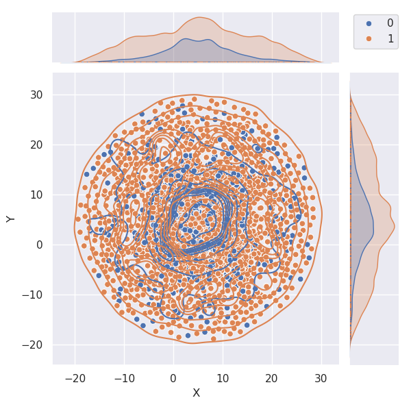

# plm-immunogenicity-bench

Benchmarking protein language model embeddings for **epitope immunogenicity**:
can a T-cell response be predicted from peptide sequence alone?

## Background

The immune system's discrimination of self from non-self peptides underlies both protective responses to pathogens and the breakdown of tolerance in autoimmunity. It is known that immunogenicity depends on MHC binding, the T-cell receptor repertoire, and processing context, but the extent to which the peptide and source antigen sequences contribute to epitope prediction remains an open question. **T cells do not see whole proteins**; in the antigen processing and presentation pathway,
a protein is first degraded into short peptides, and those peptides are presented on the
cell surface by an MHC complex, where a T cell may or may not recognise them. Whether a
given peptide provokes a response is the property we want to analyze.

Protein language models are trained like LLMs but on amino acid
sequences: each residue is a token, attention lets every residue draw
information from the others, and the output is a contextualised vector per residue.
These models have been shown to capture biophysical properties of proteins without being
told about them, which has made them effective as general-purpose features — for
instance in predicting **antibody thermostability**, where pLM embeddings fed to a simple
classifier outperformed traditionally engineered feature sets
([Chakraborty et al.](https://arxiv.org/abs/2503.20028)).

That raises the question this repository addresses:

> **Does the information a pLM captures help predict immune response?**

With one complication that shapes the whole design. Because the protein is cleaved
before presentation, **T cells never have access to the full protein sequence** — so it
is not obvious whether a peptide's embedding should be computed in the context of its
parent protein or from the peptide alone. Both are tested here.

## Approach

Peptides are embedded seven ways across three protein language models, each mean-pooled
to a single vector, then compared by how well the embedding space separates peptides
that provoked a T-cell response from those that did not.

| Variant | Model | Peptide embedded |
|---|---|---|
| `protbert` | ProtBert | in the context of the **full protein**, averaged over the peptide's positions |
| `protbertpep` | ProtBert | **alone**, peptide as the only input |
| `esmc` | ESM Cambrian 300M | in the context of the full protein |
| `esmcpep` | ESM Cambrian 300M | alone |
| `pepbert_sol` | PeptideBERT — solubility | alone |
| `pepbert_nf` | PeptideBERT — non-fouling | alone |
| `pepbert_hemo` | PeptideBERT — hemolysis | alone |

**ProtBert** is trained on billions of full-length protein sequences to predict masked
amino acids, so it encodes broad evolutionary constraints and long-range interactions.
**PeptideBERT** ([Guntuboina et al., 2023](https://doi.org/10.1021/acs.jpclett.3c02398))
fine-tunes ProtBert on three smaller peptide-property datasets — solubility, hemolysis
and non-fouling — giving three peptide-specialised variants. **ESM Cambrian 300M** is one of the latest ESM models focused on representing the underlying biology of proteins.

Taxonomic origin (Viruses / Eukaryota / Bacteria) is measured alongside immune response
as a reference label; the protein language models are expected to be able to differentiate between the biological domains.

## Results

PERMANOVA R² — the share of variance in embedding space explained by the label — on a
matched set of 65,408 peptides scored identically across all seven embeddings:

| Embedding | Immune response R² | Taxonomy R² |
|---|---:|---:|
| `protbert` | 0.0018 | 0.0467 |
| `protbertpep` † | 0.0073 | 0.0580 |
| `pepbert_nf` | 0.0019 | 0.0252 |
| `pepbert_sol` | 0.0198 | 0.0229 |
| `pepbert_hemo` | 0.0170 | 0.0564 |
| `esmc` | 0.0051 | 0.3506 |
| `esmcpep` | 0.0045 | 0.0167 |

† `protbertpep`'s embeddings were mean-pooled over padding tokens for 99.7% of peptides
(a batching bug in the original embedder, since fixed). That row will change when the
pickle is regenerated; the others are unaffected.

No embedding explains more than 2% of immunogenicity variance. Silhouette scores sit
between −0.05 and +0.05 throughout, several of them negative. Taxonomy, scored the same
way on the same peptides, reaches 35%. Embedding in protein context rather than
peptide-alone does not help.

Full metrics — silhouette, pairwise Fisher ratios, pseudo-F, p-values — in
[`results/metrics/separability.csv`](results/metrics/separability.csv).
Per-domain figures in [`results/figures/`](results/figures/).



**Working conclusion:** at ≤25 aa, peptide sequence alone may simply not carry enough information for
this task. What biological signal is missing — MHC binding geometry, TCR contact
residues, processing context — is the open question.

## Metrics

All computed on cosine distance over L2-normalised embeddings:

- **Silhouette** — `s = (b − a) / max(a, b)`, distance to own class vs. nearest other class. Range −1 to 1, higher is better separated.
- **Fisher ratio** — `F = ‖μA − μB‖ / (σ²A + σ²B)`, centroid separation scaled by within-class spread, averaged over class pairs.
- **PERMANOVA** — permutation test on the distance matrix (999 permutations), reported as pseudo-F, p, and R². The subsample is drawn once and reused across every embedding so the numbers are directly comparable.

## Data

Peptides tested for T cell responses, retrieved from **IEDB** on 11 September 2025.
Filters: linear peptides, no modifications, high-resolution HLA, tested in humans,
references from 2010 onward, epitope found within the protein sequence, protein
< 7000 aa. A peptide–MHC pair is positive if at least one assay was reported positive.

| | |
|---|---|
| Epitope rows | 30,379 (18,904 unique peptides) |
| Peptide length | 8–25 aa, median 10 |
| Immune response | 18,719 positive / 11,660 negative |
| MHC class | 16,698 class I / 13,681 class II |
| Source proteins | 4,966 unique sequences |
| With taxonomy | 58,174 assay-level rows — Viruses 36,233, Eukaryota 20,005, Bacteria 1,936 |

Tables are committed as gzipped CSV in [`data/`](data/), ~5 MB total — the pipeline runs
from them without API access. Column dictionary in [`data/README.md`](data/README.md).

```python
import pandas as pd
epi  = pd.read_csv('data/epitopes.csv.gz')
prot = pd.read_csv('data/proteins.csv.gz')
df   = epi.merge(prot, on='protein_id')
```

**Known issue:** 13 of 30,379 rows have antigen coordinates that don't locate the peptide
in the stated protein — all 13 are present at a different offset. Since embedding slices
`protein_embedding[start:end]`, those rows embed the wrong residues. Flagged via
`coord_ok`, detailed in
[`results/qc/coordinate_mismatches.csv`](results/qc/coordinate_mismatches.csv).
Filter `coord_ok == 1` before slicing.

## Layout

```
configs/                 every path and parameter; no script hardcodes one
  paths.yaml               roots, data tables, model caches
  embeddings.yaml          the 7 embeddings: where each pickle is, how to pool it
  variants/                full.yaml, mhc_i.yaml, no_anchor.yaml

data/                    committed, gzipped, ~5 MB — the pipeline starts here
  epitopes.csv.gz          30,379 peptide-MHC-antigen rows
  proteins.csv.gz          4,966 unique source proteins, keyed by content hash
  antigens.csv.gz          IEDB antigen IRI → protein_id
  epitopes_taxonomy.csv.gz assay-level rows + 12 ranks of NCBI taxonomy

src/plmbench/
  config.py  io.py         config loading; atomic write, resume, checkpointing
  data/                    loader.py (one loader for everything), taxonomy.py
  embed/                   esmc.py, protbert.py, peptidebert.py on a shared base
  analysis/                umap_runner.py, separability.py, plots.py
  check.py                 preflight: what does this machine actually have?

results/                 committed
  umap/                    slim coordinate tables, 12 MB — figures regenerate from these
  figures/                 58 PNGs, by label and model family
  metrics/                 separability.csv
  qc/                      duplicate rows, coordinate mismatches

slurm/                   bootstrap.sh builds the venv; the rest are job templates
docs/running.md          how to run it
```

Model weights and per-residue representations are not committed: 19 GB of regenerable
intermediates plus 3 GB of downloadable checkpoints. See [`.gitignore`](.gitignore).

## Reproducing

Every path and parameter lives in `configs/`. The analysis needs no GPU, and no
embeddings — the UMAP coordinates are committed.

```bash
bash slurm/bootstrap.sh                        # builds .venv, no conda needed
source slurm/env.sh

python -m plmbench.check                       # what's present on this machine
python -m plmbench.analysis.umap_runner --plots-only   # all 58 figures, from the repo alone
```

With the embedding pickles available, the full pipeline and its two ablations:

```bash
export PLMBENCH_PICKLES=/path/to/the/pickles

python -m plmbench.analysis.umap_runner --variant full
python -m plmbench.analysis.umap_runner --variant mhc_i      # class I only
python -m plmbench.analysis.umap_runner --variant no_anchor  # anchor residues trimmed
python -m plmbench.analysis.separability
```

Regenerating embeddings needs a GPU (`bash slurm/bootstrap.sh --embed`) and is the only
step that does:

```bash
sbatch slurm/embed_esmc.sh        # or embed_protbert.sh, embed_peptidebert.sh
```

Embedders checkpoint atomically and resume, so an interrupted job restarts where it
stopped. Details, including how to add an eighth embedding, in
[`docs/running.md`](docs/running.md).

## Status

The pipeline is config-driven and runs from a clone. Four forked UMAP drivers became one
runner plus three variant files, so the MHC-I and anchor-trim runs read as ablations
rather than as copies; the eleven scripts that hardcoded a cluster path no longer do;
and the SLURM templates build their own environment.

Outstanding:

- `results/metrics/separability.csv` was parsed from a previous run's stdout. Regenerate
  it with `python -m plmbench.analysis.separability`.
- Regenerate the `protbertpep` pickle — see the footnote under Results — and expect that
  row to move.
- `docs/findings.md`: `esmc` reaches R² 0.3506 on taxonomy, 6× the next best, and it is
  not simply a context artifact, since `protbert` is sliced identically and reaches
  0.0467. Unexplained, and worth writing down.

## References

- Heinzinger et al. (2019). *Modeling aspects of the language of life through transfer-learning protein sequences.* BMC Bioinformatics 20:723.
- Guntuboina et al. (2023). *PeptideBERT: a language model based on transformers for peptide property prediction.* J. Phys. Chem. Lett. 14(46):10427–10434.
- Chakraborty et al. *Not all representations are equal: comparing protein language models for antibody thermostability prediction.*

## Acknowledgements

Developed under the supervision of Ibel Carri, [Peters Lab, La Jolla Institute for Immunology](https://www.lji.org/labs/peters-lab/)

Data derived from the **Immune Epitope Database (IEDB)** and **CEDAR**, retrieved
11 September 2025. IEDB content is CC BY 4.0 and this derived dataset is redistributed
under the same terms.

Models: [ESM Cambrian 300M](https://huggingface.co/EvolutionaryScale/esmc-300m-2024-12),
[ProtBert](https://huggingface.co/Rostlab/prot_bert),
[PeptideBERT](https://github.com/ChakradharG/PeptideBERT).
